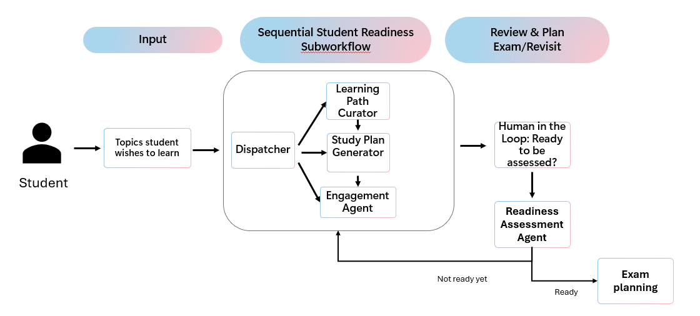

# CertPrepAgents — Multi-Agent Certification Coach

**Track 2: Reasoning Agents** | Microsoft Agents League Contest 2026

A five-agent system that coaches students through Microsoft certification exam preparation using genuine multi-step reasoning, live Microsoft Learn content retrieval, adaptive assessment with a reasoning model, targeted remediation loops, and automated engagement — all observable via OpenTelemetry distributed tracing.



---

## What It Does

A student says: *"Help me prepare for AZ-900."*

The system responds with a **five-agent pipeline** that:

1. **Curator Agent** — Searches the Microsoft Learn API for official training modules covering every exam domain. Returns real, navigable URLs grouped by domain with estimated study times.

2. **Study Plan Generator** — Converts curated modules into a structured study plan ordered by exam weight (highest-weight domains first), with per-domain hour estimates and a total timeline.

3. **Assessment Agent** *(reasoning model: o4-mini)* — Generates 10 scenario-based multiple-choice questions distributed proportionally across all certification domains. Grades each answer with educational reasoning explaining *why* the correct answer is right and *why* wrong answers are incorrect.

4. **Certification Planner** — Analyzes per-domain scores. If all domains >= 70%: recommends the next certification in the path. If any domain < 70%: produces a *targeted* remediation plan referencing the specific questions the student got wrong, with estimated remediation hours scaled to the gap size.

5. **Engagement Agent** — Sends a professional email (or logs it when SMTP isn't configured) with the study plan, assessment results, or remediation plan — complete with specific next steps and Microsoft Learn module links.

### The Remediation Loop

If the planner decides "Remediate," the system **loops back** through the pipeline focusing *only* on weak domains — up to 3 attempts. This is not a restart; it's targeted reteaching based on the student's actual mistakes.

---

## Key Technical Decisions

| Decision | Why |
|----------|-----|
| **Reasoning model for assessment** | o4-mini produces higher-quality exam questions and more accurate grading than standard models. The jury can trace this in the OTel spans. |
| **Live Microsoft Learn API** | Real content retrieval via `learn.microsoft.com/api/search` — not hallucinated URLs. Fallback to search links if the API is unavailable. |
| **Remediation loop (not restart)** | The planner diagnoses *which* domains failed and *why*, references specific wrong answers, and sends only those domains back through the pipeline. |
| **Content safety middleware** | Prompt injection detection runs *before* any agent sees the input. Blocks known injection patterns and returns a policy violation response. |
| **OpenTelemetry tracing** | Every agent turn is a traceable span. The jury can see the full reasoning chain: Curator → Study Plan → Assessment → Planner → (Remediate?) → Engagement. |
| **GitHub Models free tier** | Zero Azure spend to reproduce. `gpt-4o-mini` for standard agents, `o4-mini` for reasoning. |

---

## Architecture

```
Student Input: "Prepare me for AZ-900"
        │
        ▼
┌─────────────────────────────────────────────────┐
│            CONTENT SAFETY MIDDLEWARE             │
│  (prompt injection detection — blocks before     │
│   any agent sees the input)                      │
└────────────────────┬────────────────────────────┘
                     │
        ┌────────────▼────────────┐
        │  cert-prep-agent        │  ◄── Orchestrator with remediation loop
        │  (up to 3 attempts)     │
        └────────────┬────────────┘
                     │
    ┌────────────────▼────────────────────┐
    │       ASSESS SUB-WORKFLOW           │
    │  (sequential: 4 agents)             │
    │                                     │
    │  ┌─────────────────────────────┐    │
    │  │ 1. Curator Agent            │    │
    │  │    (gpt-4o-mini)            │    │
    │  │    Tool: SearchLearn API    │────┼──► Microsoft Learn API
    │  └──────────┬──────────────────┘    │
    │             │ JSON: modules[]       │
    │  ┌──────────▼──────────────────┐    │
    │  │ 2. Study Plan Generator     │    │
    │  │    (gpt-4o-mini)            │    │
    │  └──────────┬──────────────────┘    │
    │             │ JSON: studyPlan       │
    │  ┌──────────▼──────────────────┐    │
    │  │ 3. Assessment Agent         │    │
    │  │    (o4-mini — reasoning)    │    │
    │  │    Tool: GradeAnswers       │    │
    │  └──────────┬──────────────────┘    │
    │             │ JSON: assessmentResult│
    │  ┌──────────▼──────────────────┐    │
    │  │ 4. Certification Planner    │    │
    │  │    (gpt-4o-mini)            │    │
    │  └──────────┬──────────────────┘    │
    └─────────────┼───────────────────────┘
                  │
        ┌─────── ▼ ───────┐
        │ Decision?        │
        ├─ Pass ──────────►│ 5. Engagement Agent ──► Email (or log)
        │                  │    "Congratulations! Schedule AZ-900."
        ├─ Remediate ─────►│ Loop back to ASSESS with weak domains
        │  (attempt < 3)   │    "Focus on Networking (scored 40%)"
        │                  │
        └──────────────────┘
```

### Agent Contracts

Each agent communicates via structured JSON. Contracts are defined as C# records with source-generated serialization:

- `CuratorOutput` — certification name, modules (title, URL, domain, estimated minutes), domain list
- `StudyPlan` — certification name, domains (name, module URLs, estimated hours), total hours
- `AssessmentResult` — passed flag, overall score, per-domain scores, per-question results with reasoning
- `PlannerDecision` — Pass/Remediate enum, reasoning, remediation plan (weak domains with specific module recommendations), or recommended next certification
- `RemediationPlan` — weak domains with current/target scores, reasons referencing specific wrong answers, recommended module URLs, estimated hours

---

## Reasoning Patterns Used

| Pattern | Where | How |
|---------|-------|-----|
| **Planner–Executor** | Study Plan Generator plans → Assessment Agent executes | The planner structures *what* to study; the assessment verifies *whether* the student learned it |
| **Critic/Verifier** | Certification Planner verifies Assessment results | Analyzes per-domain scores, references specific wrong answers, decides pass/remediate |
| **Self-reflection** | Remediation loop | System reflects on failure, identifies weak domains, generates targeted remediation — not a full restart |
| **Role-based specialization** | All 5 agents | Each agent has a single responsibility with clean input/output contracts |
| **Tool-augmented reasoning** | Curator (SearchLearn), Assessment (GradeAnswers), Engagement (SendEmail) | Agents use tools to ground their reasoning in real data |

---

## Quick Start

### Prerequisites

- [.NET 10 SDK](https://dotnet.microsoft.com/download/dotnet/10.0)
- A [GitHub personal access token](https://github.com/settings/tokens) with Models access

### Setup

```bash
# Clone and navigate
git clone https://github.com/AncpLua/agentsleague-starter-kits.git
cd agentsleague-starter-kits/track-2-reasoning-agents/src/CertPrepAgents

# Set your GitHub token (used for GitHub Models free tier)
dotnet user-secrets set "GITHUB_TOKEN" "your-github-pat-here"

# Build and run
dotnet build
dotnet run
```

The DevUI is available at `http://localhost:5180` in Development mode.

### Environment Variables

See [`.env.example`](./.env.example) for all configuration options. The only required secret is `GITHUB_TOKEN`.

### Optional: OpenTelemetry

To see distributed traces, run an OTLP-compatible collector on `localhost:4317` (configurable in `appsettings.json`).

```bash
# Example with Aspire Dashboard
docker run -d -p 18888:18888 -p 4317:18889 mcr.microsoft.com/dotnet/aspire-dashboard:latest
```

### Optional: Email Delivery

Configure SMTP in `appsettings.json` or user secrets. Without SMTP, emails are logged to console with full content.

---

## Project Structure

```
track-2-reasoning-agents/
├── README.md                          # This file
├── .env.example                       # Configuration template
├── reasoning-agents-architecture.png  # Architecture diagram
├── Directory.Packages.props           # Central package management
├── Version.props                      # Package version variables
└── src/CertPrepAgents/
    ├── Program.cs                     # Agent registration, workflow, OTel, DevUI
    ├── Contracts/                     # Typed JSON contracts between agents
    │   ├── CuratorOutput.cs
    │   ├── StudyPlan.cs
    │   ├── AssessmentResult.cs
    │   ├── RemediationPlan.cs
    │   ├── PlannerDecision.cs
    │   └── JsonContexts.cs           # Source-generated JSON serialization
    ├── Prompts/                       # Agent system prompts
    │   ├── CuratorPrompt.cs
    │   ├── StudyPlanPrompt.cs
    │   ├── AssessmentPrompt.cs
    │   ├── PlannerPrompt.cs
    │   └── EngagementPrompt.cs
    ├── Tools/                         # Agent tools (grounded in real APIs)
    │   ├── LearnSearchTool.cs         # Live Microsoft Learn API search
    │   ├── GradeAnswersTool.cs        # Reasoning-model grading
    │   └── SendEmailTool.cs           # SMTP email (or logged fallback)
    ├── Middleware/
    │   └── ContentSafetyMiddleware.cs # Prompt injection guardrail
    ├── appsettings.json
    └── Properties/launchSettings.json
```

---

## Technologies

- **Microsoft Agent Framework** (`Microsoft.Agents.AI` v1.0.0-preview) — agent orchestration with sequential workflows
- **GitHub Models** (free tier) — `gpt-4o-mini` for standard agents, `o4-mini` for reasoning
- **Microsoft Learn API** — live content retrieval (`learn.microsoft.com/api/search`)
- **OpenTelemetry** — distributed tracing with OTLP export
- **.NET 10** / C# 14
- **GitHub Copilot** — used throughout development (Agent mode for architecture, Edit mode for implementations)

---

## Responsible AI

### Content Safety
- **Input guardrail**: Prompt injection patterns (jailbreak attempts, instruction override, persona manipulation) are blocked at the middleware level *before* any agent processes the input.
- **Scoped responses**: Agents are instructed to only respond to Microsoft certification preparation queries. Off-topic requests are redirected.

### Transparency
- **Traceable reasoning**: Every agent decision is logged as an OpenTelemetry span. The full reasoning chain from student input to final output is auditable.
- **Structured outputs**: All agent communication uses typed JSON contracts — no opaque text passing between agents.

### Human-in-the-Loop
- **Assessment review**: The planner provides detailed reasoning for pass/fail decisions, including specific questions and domain scores, enabling human review of the assessment quality.
- **Email confirmation**: Engagement actions are logged even without SMTP, allowing human review before enabling real email delivery.

### Fairness
- **Domain-proportional assessment**: Questions are distributed proportionally across certification domains, preventing bias toward any single topic area.
- **Evidence-based remediation**: Weak domains are identified by quantitative scores and specific wrong answers — not subjective agent judgment.

---

## Copilot Usage Log

GitHub Copilot was used throughout development:

| Mode | What | Outcome |
|------|------|---------|
| **Agent** | Designed the 5-agent architecture and remediation loop | Accepted: clean separation of concerns |
| **Agent** | Generated initial prompt templates for all 5 agents | Accepted with modifications: added JSON schema constraints |
| **Edit** | Implemented LearnSearchTool with Microsoft Learn API | Accepted: working API integration with fallback |
| **Edit** | Built ContentSafetyMiddleware | Accepted: pattern-based prompt injection detection |
| **Agent** | Created typed contracts (CuratorOutput, StudyPlan, etc.) | Accepted: source-generated JSON serialization |
| **Plan** | Planned the orchestrator remediation loop | Accepted: middleware-based loop with up to 3 attempts |
| **Ask** | Investigated Microsoft Agent Framework workflow API | Used to understand `AddWorkflow` and `AgentWorkflowBuilder.BuildSequential` |

---

## License

[MIT](../../LICENSE)
